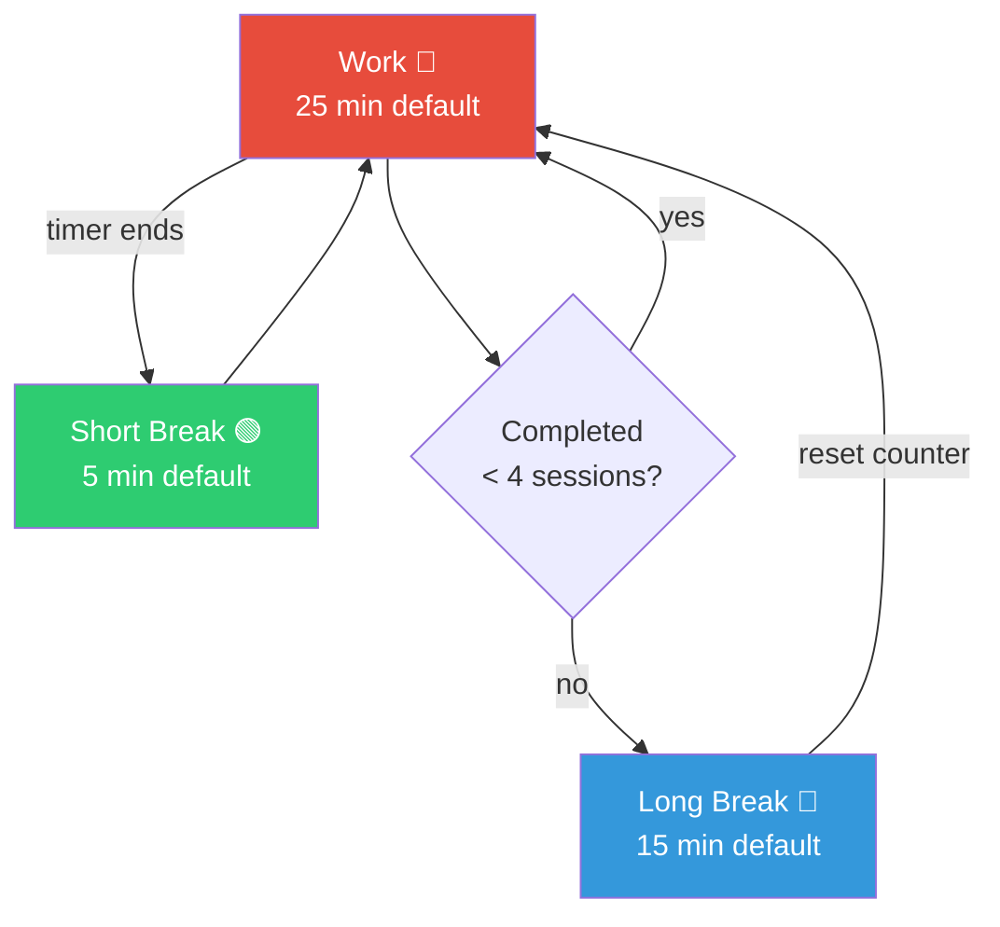

# M5Timer ⏲️

A hardware Pomodoro timer for the M5Capsule. Physical buttons, LED feedback, audio alerts, and web-sync configuration.

> Built with ❤️ by [QQ](https://github.com/QQSHI13) & [Nova ☄️](https://openclaw.ai)

---

## ✨ Features

- **🔘 Physical Controls** — Real buttons for start/pause, mode switching, and settings
- **💡 LED Feedback** — Color-coded NeoPixel LED shows current mode at a glance
- **🔊 Audio Alerts** — Distinct buzzer melodies for work end, break end, and notifications
- **🌐 Web Sync** — Configure everything via USB from your browser (Web Serial API)
- **💾 Persistent Storage** — Settings and timer state saved to flash (survives power loss)
- **🔋 Battery Efficient** — Light sleep between ticks, 80MHz CPU, auto power-off
- **⏰ RTC Support** — BM8563 real-time clock keeps accurate timing even in sleep
- **🧠 Pomodoro Logic** — Work → Break → Work → Long Break cycle with session tracking

---

## 📦 What's in the Box

| Component | Description |
|-----------|-------------|
| M5Capsule | ESP32-S3 based microcontroller with built-in display, battery, and USB-C |
| USB-C Cable | For charging and data (web sync) |

---

## 🚀 Quick Start

### 1. Device Setup

```bash
# Clone the repository
git clone https://github.com/QQSHI13/M5Timer.git
cd M5Timer

# Install PlatformIO (if not already installed)
pip install platformio

# Build and flash the firmware
pio run --target upload

# (Optional) Monitor serial output
pio device monitor
```

### 2. First Power-On

1. Press the button **once** to exit the idle screen
2. The LED glows **red** — you're in Work mode
3. Press the button **once** to start the timer
4. You're now in a Pomodoro session!

> **Note:** Default settings are 25 min work, 5 min break, 15 min long break, 4 sessions before long break.

---

## 📖 How to Use

### System Modes

The M5Timer has four system modes:

| Mode | Purpose | How to Enter | LED Behavior |
|------|---------|--------------|-------------|
| **INITIAL** | Idle/setup screen | Power on, or reset | Rainbow animation then mode color |
| **TIMER** | Active countdown | Single press from INITIAL | Solid color (red/green/blue) |
| **SWITCH** | Change timer mode | Double press during TIMER | Blinking mode preview |
| **SYNC** | Web configuration | Hold 2 seconds | White breathing |

### Button Controls

| Action | In TIMER Mode | In SWITCH Mode | In SYNC Mode |
|--------|---------------|----------------|--------------|
| **Single press** | Start/Pause timer | Select mode + return to TIMER | — |
| **Double press** | Enter SWITCH mode | — | — |
| **Hold 2s** | Enter SYNC mode | Cancel, return to TIMER | Exit SYNC mode |

### Timer Flow (Pomodoro Cycle)



The Pomodoro algorithm:
```
workSessionsCompleted = 0

START WORK
  ↓ timer completes
IF workSessionsCompleted + 1 >= sessionsBeforeLongBreak:
  → LONG BREAK
  → workSessionsCompleted = 0
ELSE:
  → BREAK
  → workSessionsCompleted += 1
```

### Detailed Walkthrough

#### Step 1: Power On
When you first power on the M5Timer:
- The LED plays a **startup rainbow animation**
- The screen shows the **mode selection overlay** (Work/Break/Long Break)
- Press **once** to confirm and enter TIMER mode with the selected mode
- Wait or press to proceed

#### Step 2: Starting a Session (TIMER Mode)
- **Single press** → Starts the countdown
- **Single press again** → Pauses the countdown (the LED stays on)
- **Single press again** → Resumes the countdown
- **Double press** → Enters SWITCH mode

During the countdown:
- The LED shows a solid color (red for work, green for short break, blue for long break)
- In the last 5 seconds, the buzzer **beeps once per second**
- When the timer ends, a **melody** plays and the timer auto-transitions to the next mode

#### Step 3: Switching Modes (SWITCH Mode)
If you need to switch to a different timer type mid-session:
1. **Double press** to enter SWITCH mode
2. The LED starts **blinking** the current mode's color
3. The screen shows the **preview overlay** for the currently selected mode
4. Press again to cycle to the next timer type:
   - Work → Break → Long Break → Work...
5. Once you see the mode you want, **press again** to select it and return to TIMER mode
   - If you were in a running session, the elapsed time is discarded
   - If you interrupted a Work session, the session counter does **NOT** increment
6. Wait 4 seconds with no input → auto-returns to TIMER mode without changing

#### Step 4: Web Sync Configuration (SYNC Mode)
1. **Hold the button for 2 seconds** to enter SYNC mode
2. The LED shows a **white breathing** effect
3. Connect the M5Timer to your computer via USB-C
4. Open **[https://qqshi13.github.io/M5Timer](https://qqshi13.github.io/M5Timer)** in Chrome/Edge
5. Click **"Connect"** and select your device (it shows as "ESP32-S3" or similar)
6. You'll see current settings:

   | Setting | Default | Description |
   |---------|---------|-------------|
   | Work Duration | 25 min | How long each work session lasts |
   | Break Duration | 5 min | Short break between work sessions |
   | Long Break Duration | 15 min | Long break after 4 sessions |
   | Sessions Before Long Break | 4 | Number of work sessions before a long break |
   | Sound Enabled | Yes | Toggle buzzer on/off |
   | LED Brightness | 16/255 | Brightness of the NeoPixel LED |
   | Buzzer Volume | 24/255 | Volume of the piezo buzzer |

7. Adjust settings and click **Sync** to send them to the device
8. The device confirms with a **chime** and automatically exits SYNC mode
9. Settings are saved to flash and persist across power cycles

> **Note:** Web Serial API only works in **Chrome or Edge**. Firefox and Safari are not supported.

---

## 💡 LED Color Reference

| Color | Meaning |
|-------|---------|
| 🔴 Red | Work timer active/ready |
| 🟢 Green | Short break timer active/ready |
| 🔵 Blue | Long break timer active/ready |
| Blinking color | SWITCH mode — previewing a timer type |
| 🤍 White (breathing) | SYNC mode — waiting for web connection |
| Rainbow (startup) | Device powering on |
| Rapid green blink (×3) | Settings synced successfully |
| Rapid red blink | Error occurred |
| Fade out | Timer ended, transitioning modes |
| Fast flash | Flash read/write error |

---

## 🔊 Audio Reference

| Melody | When It Plays |
|--------|---------------|
| **Triumphant fanfare** (C5-E5-G5-C6) | Work timer completed |
| **Gentle descending** (G5-E5-C5-G4) | Break timer completed |
| **Single beep** (per second, last 5s) | Final countdown |
| **Bell chime** (E5-G5-B5) | Settings synced successfully |
| **Quick blip** | Mode switched |
| **Reset confirmation** | Device reset or initial setup |

---

## ⚙️ Settings Reference

### Default Values

```
workMinutes                 = 25
breakMinutes                = 5
longBreakMinutes            = 15
workSessionsBeforeLongBreak = 4
soundEnabled                = true
ledBrightness               = 16   (range 0–255)
buzzerVolume                = 24   (range 0–255)
```

### Persistence
- Settings survive power loss (stored in NVS flash)
- Timer state (mode, remaining time, running status) also saved
- Timer state saves periodically (every 60 seconds) to minimize flash wear

---

## 🛠️ Hardware Reference

| Pin | Component |
|-----|-----------|
| GPIO 21 | NeoPixel LED (WS2812) |
| GPIO 42 | Button (input) |
| GPIO 2 | Piezo buzzer (PWM) |
| GPIO 46 | Power control |
| I²C (Wire1) | BM8563 RTC |

### Technical Specs
- **MCU:** ESP32-S3 @ 80MHz (downclocked from 240MHz for battery life)
- **RTC:** BM8563 (keeps time during deep sleep)
- **LED:** 1× WS2812 NeoPixel
- **Buzzer:** Passive piezo (PWM driven)
- **Battery:** Built-in Li-Po (charged via USB-C)
- **USB:** USB-C (CDC serial for web sync, charging)

---

## 🔋 Battery & Power

### Normal Usage
- CPU runs at 80MHz (lower than default 240MHz) to save power
- Device enters **light sleep** between timer ticks (1-second intervals)
- Light sleep wakes on:
  - RTC alarm (1-second tick)
  - Button press (GPIO interrupt)

### Charging
- Connect USB-C to any USB charger or computer
- Charging is handled by the M5Capsule's built-in charging circuit
- No charging indicator — check the device screen

### Storage
- Device auto-saves state every 60 seconds during active timing
- State also saves on mode transitions and before sleep
- If the battery dies mid-session, the timer resumes from the saved state on next power-on

---

## 🧪 Troubleshooting

| Problem | Likely Cause | Solution |
|---------|-------------|----------|
| Device won't turn on | Battery depleted | Charge via USB-C for 15+ minutes |
| Timer doesn't start | Button issue | Try pressing more firmly, check button response by entering SYNC mode |
| Web page doesn't find device | Wrong browser | Use Chrome or Edge (Web Serial API required) |
| "Failed to connect" in browser | Serial port busy | Disconnect any other serial monitor (Arduino IDE, pio device monitor) |
| Timer resets mid-session | Battery died | State was saved — timer resumes from last save on next boot |
| No sound | Sound disabled in settings | Toggle sound via web sync, or check `soundEnabled` in saved settings |
| LED too bright/dim | Brightness setting | Adjust via web sync (range 0–255) |
| Device won't enter web sync mode | Hold time too short | Try holding the button for a full 2 seconds — LED should turn white |
| Can't flash firmware | USB driver issue | On Windows: install CP210x / CH340 drivers. On Linux: check `udev` rules |
| Timer skips forward on mode switch | RTC state bug | Full power cycle (unplug battery + USB, wait 10s, reconnect) |
| Web sync shows wrong values | NVS corruption | Factory reset by re-flashing firmware (`pio run --target upload`) |

---

## 🐛 Known Issues

- Web Serial API only works in Chrome/Edge
- Battery life depends on LED brightness setting
- `CORE_DEBUG_LEVEL=3` is enabled in `platformio.ini` — comment out for production to save power

---

## 📝 Developer Notes

### Firmware Architecture

```
main.cpp
├── setup()           — Init hardware, load settings, enter INITIAL mode
├── loop()
│   ├── handleInitialMode()   — Idle screen, press to confirm
│   ├── handleTimerMode()     — Active countdown, start/pause/switch
│   ├── handleSwitchMode()    — Mode selection, cycle + confirm
│   └── handleSyncMode()      — Web Serial sync, white breathing LED
├── button.cpp        — Debouncing, single/double click detection
├── led.cpp           — NeoPixel color control, effects (breathing, blink, rainbow)
├── buzzer.cpp        — PWM tone generation, melody sequences
├── storage.cpp       — NVS flash read/write for settings + timer state
├── timer_logic.cpp   — Pomodoro cycle logic (Work → Break → Long Break)
├── sync.cpp          — Web Serial protocol, command parsing
└── hardware.cpp      — Power, RTC initialization
```

### Firmware Architecture Protocol
Web sync uses a simple text-based serial protocol over USB CDC:
```
Device → PC:  "work=25,break=5,longBreak=15,sessions=4,sound=1,brightness=16,volume=24\n"
PC → Device:  "work=25,break=5,longBreak=15,sessions=4,sound=1,brightness=16,volume=24\n"
```

---

## 🔮 Future Plans

- [ ] Vibration motor support
- [ ] Multiple timer profiles (save/load presets)
- [ ] WiFi sync for remote configuration
- [ ] E-ink display version
- [ ] Custom sound upload via web sync

---

## 📄 License

[GPL-3.0 License](LICENSE) — Free to use, modify, and share.

---

## 🙏 Credits

Built with ❤️ by [QQ](https://github.com/QQSHI13) & [Nova ☄️](https://openclaw.ai)

Powered by [OpenClaw](https://openclaw.ai)

---

**⭐ Star this repo if you find it useful!**

## Star History

<a href="https://www.star-history.com/?repos=QQSHI13%2FM5Timer&type=date&legend=top-left">
 <picture>
 <source media="(prefers-color-scheme: dark)" srcset="https://api.star-history.com/chart?repos=QQSHI13/M5Timer&type=date&theme=dark&legend=top-left" />
 <source media="(prefers-color-scheme: light)" srcset="https://api.star-history.com/chart?repos=QQSHI13/M5Timer&type=date&legend=top-left" />
 
 </picture>
</a>
